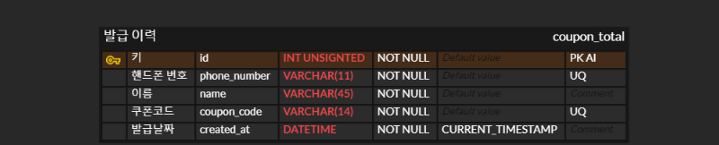

# coupon-project

## 요구 기능
### Page 1. 게임 쿠폰 발급 페이지 개발
게임 쿠폰을 발급할 수 있는 페이지
- 조건 1: 이름, 휴대전화 번호 입력
- 조건 2: 중복되지 않은 쿠폰 번호 발급 (12 자리) ex) xxxx-xxxx-xxxx 
- 조건 3: 이미 발급받은 휴대전화 번호 체크 후 발급 제한, 중복에 대한 알림 표기
  
  

### Page 2. 발급 이력 페이지
지금까지 발급받은 전체 쿠폰 리스트를 화면에 노출
- 조건 1:  이름, 휴대전화 번호 검색
ex. 이름 // 휴대전화 번호 // 쿠폰 번호 // 발급 일자

  

## 구현 기능

### 데이터베이스
**ERD**

  

### 백엔드
#### 게임 쿠폰 발급 API 구현
1. **API 로직**
- [x] 이름과 핸드폰 번호를 전달 받는다
- [x] 핸드폰 번호를 db에서 조회하고 존재한다면, 중복 알림 메시지
- [x] 핸드폰 번호를 db에서 조회하고 존재하지 않는다면, 쿠폰을 발급한다

  

2. **쿠폰 발급 로직 (중복체크)**
- [x] 쿠폰 번호는 voucher-code-generator 라이브러리를 이용한다.
- [x] 쿠폰 발급 시, 중복된 쿠폰 번호가 있는지 체크한다
- [x] 중복된 쿠폰 번호가 없다면, 해당 번호를 발급한다
- [x] 중복된 쿠폰 번호가 있다면, 다른 번호를 발급한다 (성공할 때까지 반복)
- [**구현코드**](https://github.com/swywssaid/coupon-project/blob/c44bcde99fa46f876ab85b10ce2ded401d4ef43b/server/db/mysql.js#L45)

  

#### 발급 이력 페이지 API 구현
- [x] DB에서 모든 정보를 조회한다
- [x] 조회된 정보를 클라이언트에 전달한다

  

### 프론트엔드
#### 게임 쿠폰 발급 페이지 구현
- [x] 이름, 휴대번호 입력 폼 구현
- [x] 발급받기 버튼 구현
- [x] 이름, 휴대번호 유효성 검사 통과 시, 발급받기 버튼 활성화
- [x] 발급받기 버튼 클릭 시, 서버로 이름, 휴대번호 전송
- [x] 발급 성공 시, 쿠폰 번호 제공
- [x] 발급 실패 시, 메시지 알림

  

#### 발급 이력 페이지 구현

1. **검색기능**
- [x] 검색창 구현 (name, phone)
- [x] 서버로 page, pageSize, name, phone을 쿼리 스트링으로 전달한다
- [x] useDebounce 커스텀 훅으로 검색 요청 최적화
- [**구현코드**](https://github.com/swywssaid/coupon-project/blob/main/client/src/pages/HistoryPage.jsx#L18)

  

2. **발급이력(페이지네이션)**
- [x] 전달 받은 발급 이력은 10개씩 보여준다

 

3. **페이지전환(페이지네이션)**
- [x] 페이지 번호는 한 화면에 5개씩 보여준다
- [x] 5개 이하 시, 해당하는 페이지까지만 나타낸다
- [x] 5개 초과 시, 다음으로 넘어가는 버튼 구현
- [x] 다음 버튼 클릭 시, 다음 5개의 페이지 번호가 나타남
- [**구현코드**](https://github.com/swywssaid/coupon-project/blob/main/client/src/components/HistoryPage/Pagination.jsx#L11)